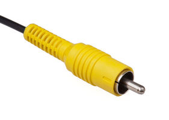
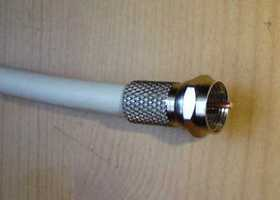
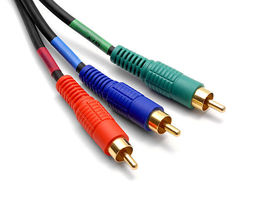

# The Cable Bible
A comprehensive guide to cables and connectors potentially used for audiovisual/media preservation. Cable types and connectors are organized by the primary purpose of the signal being transferred - video, audio-only, data (i.e. computer cables) and power. Examples of physical connectors, pinouts and contextual uses for each kind of cable are nested within descriptions of signal types, wiring, interfaces and protocols!

## Contribute ##
Please feel free to clone this repository or create a new branch with your own additions of signal types, interfaces or connectors you think we're missing (there's a lot!). There are already some checklists under the [Issue] (https://github.com/amiaopensource/cable-bible/issues) page that show what at least needs to be filled in from the current TOC. Submit a pull request so that someone can review your changes and make sure that everything remains at least somewhat orderly - or if you're not so comfortable with github but have photos or information that you think should be added, please submit an issue and I'll update when I can!

## License ##
 This work is licensed under a <a rel="license" href="http://creativecommons.org/licenses/by-sa/4.0/">Creative Commons Attribution-ShareAlike 4.0 International License</a>

## Table of Contents ##

1. [Video] (README.md#video) :tv:
  1. [Analog] (README.md#analog)
    1. [Composite] (README.md#composite)
    2. [Component YPbPr] (README.md#component-ypbpr)
    3. [S-Video] (README.md#s-video)
    4. [RGBS] (README.md#rgbs)
    5. [RGBVH] (README.md#rgbvh)
  2. [Digital] (README.md#digital)
    1. [SDI] (README.md#sdi)
    2. [FireWire (IEEE 1394)] (README.md#firewire)
    3. [DVI] (README.md#dvi)
    4. [DisplayPort] (README.md#displayport)
    5. [HDMI] (README.md#hdmi)
  3. [Integrated] (README.md#integrated)
    1. [DVI-I] (README.md#dvi-i)
2. [Audio] (README.md#audio) :sound:
  1. [Analog] (README.md#analog-1)
    1. [Balanced] (README.md#balanced)
    2. [Unbalanced] (README.md#unbalanced)
  2. [Digital] (README.md#digital-1)
    1. [AES-3 (AES/EBU)] (README.md#aes-3)
      1. [Balanced] (README.md#balanced-1)
      2. [Unbalanced] (README.md#unbalanced-1)
    2. [S/PDIF] (README.md#spdif)
      1. [Optical] (README.md#optical)
      2. [Unbalanced] (README.md#unbalanced-2)
    3. [MIDI] (README.md#midi)
      1. [Balanced] (README.md#balanced-2)
    4. [TDIF] (README.md#tdif)
      1. [Unbalanced] (README.md#unbalanced-3)
    5. [ADAT] (README.md#adat)
      1. [Optical] (README.md#optical-1)
3. [Data] (README.md#data) :computer: :floppy_disk:
  1. [Parallel] (README.md#parallel)
    1. [PATA] (README.md#pata)
    2. [Parallel SCSI] (README.md#parallel-scsi)
    3. [IEEE 1284 ("Parallel Port", "printer port", "Centronics port")] (README.md#ieee-1284)
  2. [Serial] (README.md#serial)
    1. [RS-232 ("the serial port")] (README.md#rs-232)
    2. [RS-422] (README.md#rs-422)
    3. [SAS (Serial Attached SCSI)] (README.md#serial-scsi)
    4. [SATA] (README.md#sata)
    5. [Apple Desktop Bus] (README.md#apple-desktop-bus)
    6. [PS/2] (README.md#ps2)
    7. [USB] (README.md#usb)
      1. [USB 2.0] (README.md#usb-20)
      2. [USB 3.0] (README.md#usb-30)
      3. [USB 3.1] (README.md#usb-31)
    8. [FireWire] (README.md#firewire-1)
      1. [FireWire 400] (README.md#firewire-400)
      2. [FireWire 800] (README.md#firewire-800)
    9. [ThunderBolt] (README.md#thunderbolt)
      1. [ThunderBolt 1 and 2] (README.md#thunderbolt-1-and-2)
      2. [ThunderBolt 3] (README.md#thunderbolt-3)
    10. [HDBaseT] (README.md#hdbaset)
4. [Power] (README.md#power)

## Video ##
### Analog ###
Analog audiovisual media record image and sound information as a continuous signal stored in or on the media itself (in the case of most "video" formats, as a continually fluctuating level of magnetic field strength on tape). Different types of video processing can allow that signal to be carried along different channels, with each channel representing a different portion of the video information (e.g. luminance/brightness, chrominance/color, sync). The types of cable you will need to work with an analog video signal will depend primarily on how these channels have been divided, as well as considerations of signal-to-noise ratio - all analog signals are subject to some degree of electronic noise or distortion, and different connection standards and interfaces have been developed to combat such signal degradation.  

#### Composite ####
  In composite cables, all video information (including both luminance and chrominance) is encoded on to a single channel/wire. As all information is traveling along one channel, composite video is the most susceptible to noise in the signal.  
  
  **Introduced:** 1956  
  **Max resolution:** Standard Definition (typically 480i or 576i)  
  **Connectors and ports:**  
  
     
  [_RCA_](pinouts.md#rca)  
  Used primarily with consumer equipment (e.g. Betamax, VHS, DVD)  
  Audio: no
  
     
  [_BNC_](pinouts.md#bnc)  
  Used in professional broadcast and some consumer equipment  
  Audio: no
  
     
  _UHF_  
  A WWII-era connector design originally intended for video connections in radar applications. Used with late-period 1/2" open reel decks (e.g. Sony AV decks) and some early 3/4" U-matic players.  
  Audio: no  
  
     
  _F-type_  
  Found in North American television antenna, cable and satellite television installations; some older VCRs  
  Audio: no
  
     
  _Video patch (MUSA)_  
  Originally developed for manually switching signals in radar installations; now commonly used for patch bays in production and preservation workflows.  
  Audio: no
  
     
  [_8-pin EIAJ_](pinouts.md#8-pin-eiaj)  
  Monitor cables designed specifically to carry both input and output signal between a video deck and monitor over the same cable. Seen on 1/2" open reel decks (the only available output on Sony CVs), 3/4" U-matic, and contemporary monitors.  
  Audio: yes, stereo, unbalanced
  
     
  [_SCART_](pinouts.md#scart)  
  European 21-pin connector designed to be capable of carrying both input and output of multiple signal standards, including composite video (see also: [S-Video] (README.md#s-video), [RGBS] (README.md#rgbs), [YPbPr] (README.md#component-ypbpr)).  
  Audio: yes, stereo, unbalanced  
  
#### Component YPbPr ####
YPbPr signal is often referred to, imprecisely, simply as "component" video, although there are actually several standards of component video (any signal standard that splits video information into multiple channels is component, including S-Video and the multiple RGB standards). In YPbPr, the video signal is split into three channels: Y (containing luminance and sync), Pb (the difference between blue and luma), and Pr (the difference between red and luma). The remaining (green) chrominance information is derived from the relationship between these three signals. YPbPr cables are sometimes referred to as "yipper" cables and are connectors are usually color-coded (Y=green, Pb=blue, Pr=red); however YPbPr cables are fundamentally wired the same as composite cables and can be used interchangeably as long as the corresponding ports are properly connected.

**Introduced:**  
**Max resolution:** High Definition (up to 1080p)  
**Connectors and ports:**  

   
[_RCA_](pinouts.md#rca)  
Used primarily with consumer equipment  
Audio: no

   
[_BNC_](pinouts.md#bnc)  
Seen with professional broadcast and production equipment, some consumer electronics  
Audio: no  

   
[_SCART_](pinouts.md#scart)  
European 21-pin connector designed to be capable of carrying both input and output of multiple signal standards; a YPbPr pinout is possible with a SCART connector but extremely rare as European monitors generally did not support YPbPr input.  
Audio: yes, stereo, unbalanced  

#### S-Video ####
S-Video (sometimes known as "separate video") cables carry video over two synchronized signal channels: Y (luma) and C (chroma, including saturation and hue). It can achieve better image quality than composite but lower color resolution than component RGB or YPbPr video. Most often associated with S-VHS but found with many other consumer deck formats as well.  

**Introduced:**  
**Max resolution:** Standard Definition (generally 480i or 576i)  
**Connectors and ports:**  

   
[_Mini-DIN 4-pin_](pinouts.md#mini-din-4-pin)  
The most common type of S-Video connector. The exact same mini-DIN connector is used for the [Apple Desktop Bus] (README.md#apple-desktop-bus) data protocol and these cables are interchangeable.  
Audio: no  

  
[_BNC_](pinouts.md#bnc)  
Generally for use in some S-Video patch panels.  
Audio: no

   
[_SCART_](pinouts.md#scart)  
European 21-pin connector designed to be capable of carrying both input and output of multiple signal standards; an S-Video pinout is possible with a SCART connector but rare, as European monitors generally did not support S-Video input.  
Audio: yes, stereo, unbalanced  

#### RGBS ####
A component video standard in which luminance and chrominance information is encoded into three channels (red, green and blue) and a fourth is used for composite sync (vertical and horizontal sync encoded together on the same wire). RGBS utilizes no compression and has no particular limit on color depth or resolution, but requires a high bandwidth as the three channels carry much redundant information (i.e. the same black-and-white luma information repeated three times). Extremely common in European equipment (especially monitors), rare elsewhere.  

**Introduced:**  
**Max resolution:** Generally up to 1080p (HD), but can go beyond  
**Connectors and ports:**  

   
[_SCART_](pinouts.md#scart)  
European 21-pin connector designed to be capable of carrying both input and output of multiple signal standards. RGBS cables most frequently have SCART connectors and vice versa.  
Audio: yes, stereo, unbalanced  

#### RGBVH ####
A component video standard essentially the same as [RGBS] (README.md#rgbs), except the sync signal is split into vertical and horizontal sync on separate wires. Most frequently employed in the context of the Video Graphics Array (VGA) display standard.  

**Introduced:**  
**Max resolution:** Generally up to 1080p (HD), but can go beyond  
**Connectors and ports:**  

   
[_VGA (DE-15)_](pinouts.md#de-15)  
A 15-pin D-sub connector commonly offered on modern computers for display connections.  
Audio: no  

   
[_Mini-VGA_](pinouts.md#mini-vga)  
Used to adapt VGA/RGBVH signals input and output for laptop computers.  
Audio: no  

  
[_BNC_](pinouts.md#bnc)  
Found with some high-end monitors and video cards. Wires are usually color-coded, though the colors used for the two sync signals sometimes varies: e.g. yellow (H) and white (V), yellow (H) and black (V), gray (H) and black (V).  
Audio: no  

   
[_DVI-A_](pinouts.md#dvi)  
Much more frequently found in its [DVI-D] (README.md#dvi) and [DVI-I] (README.md#DVI-I) flavors, Digital Video Interface (DVI) is designed to transmit uncompressed digital video information, but can be compatible with analog RGBVH video through the VGA interface. DVI-A (analog) cables and connectors are essentially the same electrically as VGA cables and connectors.  
Audio: no  

   
[_Mini-DVI_](pinouts.md#mini-dvi)  
Used on certain Apple computers, especially laptops, to accept a DVI-A/VGA connection.  
Audio: no  

### Digital ###
As opposed to [analog video] (README.md#analog), in digital recording the video and/or audio signal is converted into a stream of numbers (bits), that collectively represent the luminance, chrominance, and other values that make up the image. The stream must be converted back into analog waveforms to be viewed on a monitor/video screen. Provided electrical noise is not too great, it will theoretically not affect the quantification of the signal. Different standards for digital video and audio have developed in order to make it possible to pass more information along one connection in the same (or shorter) amount of time (also to make it possible to send audio information along the same cable/connection as video).  

#### SDI ####
Serial Digital Interface (SDI) actually refers to a family of SMPTE interface standards designed for the transmission of uncompressed, unencrypted digital video signals. The original standard ("SD-SDI"), defined for 480i and 576i standard definition video, has been periodically updated (e.g. HD-SDI, 6G-SDI) to allow for steadily increasing bit rates, frame rates, video resolutions, etc. Because SDI is an unencypted digital signal, it has generally been restricted from use in consumer equipment, and is usually found in professional, broadcast-grade production and preservation environments.

**Introduced:** 1989  
**Max resolution and data rate:** As of 2015, the 12G-SDI standard allows up to 2160p60 video at 12 Gb/s  
**Connectors and ports:**  

   
[_BNC_](pinouts.md#bnc)  
SDI-compatible equipment almost always employ BNC connections, especially in broadcast/production environments. Note: even though they use the same connectors, SDI coax cables using BNC are wired differently than composite/component video cables that use BNC, and the two are not interchangeable.  
Audio: yes

  
_Video patch (MUSA)_  
Video patch connections can be used to transfer SDI signals through a patch bay.  
Audio: No  

#### FireWire ####
IEEE 1394, referred to as "FireWire," was developed by Apple as an interface for high-speed data transfer (see: [FireWire] (README.md#firewire-1) section under Data signals). However the FireWire interface was also employed by digital cameras recording to tape media with the DV (Digital Video) protocol (e.g. MiniDV, DVCAM, DVCPRO). Some camcorders were also able to directly output a DV signal to a digital video recorder or computer via a FireWire cable/interface.  When used with digital video, the FireWire interface operates at a slower data rate than in most of its data transfer applications.  
**Introduced:** 1994  
**Max resolution and data rate:** Standard Definiton, 100 Mb/s  
**Connectors and ports:**  

   
[_4-pin_](pinouts.md#firewire)  
The smallest type of FireWire connector - found on DV cameras.  
Audio: yes  

#### DVI ####
Digital Video Interface (DVI) was designed to transmit uncompressed digital video while also supporting analog video modes (see [DVI-A] (README.md#rgbvh), [DVI-I] (README.md#dvi-i)). This broad compatibility led ot widespread adoption in consumer electronics/computers. 
**Introduced:** 1999  
**Max resolution and data rate:**  _Single Link_: 1920x1200, 4.95 Gb/s, _Dual Link_: 2560x1600, 9.90 Gb/s  
**Connectors and ports:**  

   
[_DVI-D Single Link_](pinouts.md#dvi)  
Employs a single transmitter to support 1920x1200 resolution digital video. Notably missing the 4 pins present in DVI-A and DVI-A to carry analog video signal.  
Audio: no  

   
[_DVI-D Dual Link_](pinouts.md#dvi)  
The same as DVI-D Single Link connectors, except with six additional pins in the center of the connector/port to increase bandwidth and support higher resolutions.  
Audio: no  

   
[_Mini-DVI_](pinouts.md#mini-dvi)  
Used on some laptops, especially Apple products, to accept a DVI-D signal.  
Audio: no  

   
_Micro-DVI_  
Employed for a very brief time by Apple specifically on its 2008 MacBook Air line of laptops. Smaller than Mini-DVI connectors but can only accept DVI-D signals (incompatible with DVI-I or DVI-A) and almost immediately replaced by the [DisplayPort] (README.md#displayport) standard.  
Audio: no  

#### DisplayPort ####
A digital display interface standard developed by the Video Electronics Standards Association (VESA). Can be used to carry audio and packeted data transmissions, but most frequently employed to connect video sources to display devices. The development of succeeding versions of the DisplayPort standard (from 1.0 to the latest 1.4) have allowed for increases in display resolution, data rate, color depth, etc. "Dual-Mode DisplayPort" ports and connectors (also known as DisplayPort++) are also compatible with single-link DVI and HDMI output with the use of adapters; active converters are also available to make DisplayPort compatible with dual-link DVI or DVI-A/VGA signals.  
**Introduced:** 2008  
**Max video resolution and data rate:** _1.0/1.1_: 1.62 Gb/s, _1.2_: 2.7 Gb/s, _1.3_: 8K UHD, 5.4 Gb/s, _1.4_: 8K UHD, 8.1 Gb/s
**Connectors and ports:**  

   
[_DisplayPort (20-pin)_](pinouts.md#displayport)  
The full-size, 20-pin DisplayPort connection used for external connections on desktop computers, graphics cards, monitors, etc.
Audio: yes, optionally (use of channels for audio signal will limit bandwidth, resolution available for video)  

   
[_Mini DisplayPort_](pinouts.md#displayport)  
Miniaturized version of the DisplayPort connector developed by Apple. Used on Apple products, especially laptops, from 2008 to the present (from ~2011 on, paired with the DisplayPort-compatible [ThunderBolt] (README.md#thunderbolt) protocol). Licensed out to many PC manufacturers as well.  
Audio: yes (if used in conjunction with an audio-capable DisplayPort or HDMI cable)  

#### HDMI ####
High-Definition Multimedia Interface (HDMI) is a proprietary interface for transferring uncompressed digital video and audio signals. HDMI was developed in order to provide an integrated, increased-bandwidth interface capable of carrying very high video resolutions and an audio signal while maintaining backwards compatibility with DVI. As with DisplayPort, succeeding versions (from 1.0 to current 2.0) have allowed for increases in resolution, frame rate, data rate, etc.  
**Introduced:** 2002  
**Max video resolution and data rate:** _1.0/1.1/1.2_: 1920x1200p, 4.95 Gb/s, _1.3/1.4_: 2560x1600p, 10.2 Gb/s, _2.0_: 4096x1600p, 18 Gb/s  
**Connectors and ports:**  

   
[_Type A ("Standard","Full Size")_](pinouts.md#hdmi)  
Generally used for HDMI input/output on television/computer monitors and desktops.  
Audio: yes  

   
[_Type C ("Mini")_](pinouts.md#hdmi)  
Employed starting with HDMI Version 1.3 - designed for smaller, portable equipment such as laptops.  
Audio: yes  

   
[_Type D ("Micro")_](pinouts.md#hdmi)  
Released starting with HDMI Version 1.4, intended for use with cell phones/smart phones.  
Audio: yes  

### Integrated ###
There is no such thing as a signal that combines analog and digital data in the same channel. However, The DVI interface allows for both analog and digital signals to be passed through the same cable and connector, creating something of a unique case.  

#### DVI-I ####
DVI are backwards-compatible to allow for the transmission of analog RGBVH data via the VGA standard. The cable is the same as that employed by [DVI-A] (README.md#rgbvh) (analog-only) or [DVI-D] (README.md#dvi) (digital only), the difference with DVI-I is merely in the compatible connectors and ports.  

  
[_Single-Link DVI-I_](pinouts.md#dvi)  
Contains pins that allow for an analog VGA signal or digital video at up to 1920x1200 resolution.  
Audio: no  

   
[_Dual-Link DVI-I_](pinouts.md#dvi)  
The same as Single-Link DVI-I, but adds six pins in the middle of the connector for increased digital video resolution up to 2560x1600.  
Audio: no  

   
[_Mini-DVI_](pinouts.md#dvi)  
Can connect either an analog or digital signal to an Apple laptop, as long as the proper adapter is used in conjunction with a DVI cable with DVI-A, DVI-D or DVI-I connectors.  
Audio: no  

## Audio ##
### Analog ###
Unlike analog video, analog audio signals are essentially only ever transferred over one channel (i.e. one-track monaural/"mono") or two (two-track mono, or stereo). Analog audio cables, generally speaking, thus only had to carry one channel of audio and two cables would simply be employed for recording or reproducing two-track mono or stereo (in contrast to the proliferation of standards and cables for video - composite, S-Video, RBG, etc). The most critical characteristic in regard to analog audio cabling, then (beyond connector types), regards balanced vs. unbalanced wiring, a method employed to reduce noise interference in audio cables.  

#### Balanced ####
Balanced coaxial audio cables contain three wires: "earth" (electrical ground), "hot" (positive audio signal), and "cold" (negative audio signal). The audio signal is transferred on both the hot and cold lines, but the voltage in the cold line is inverted (i.e. signal is negative when the hot line's is positive, and vice versa). When the cable is plugged into an input, the hot and cold signals are mixed together, but the cold signal is also inverted again. This has the effect of strengthening the original, recorded audio signal (doubling the number of wires it was carried on) while also canceling out the signal of any unintentional noise in the signal picked up as the audio traveled over the cable. (Since that noise was essentially "recorded" positively on to both the hot and cold lines, flipping the polarity of the cold line at input gives you exact opposite noise signals, which cancel each other out)  

Reducing analog audio noise is an issue primarily with longer cables, or in professional/broadcast or preservation environments, where the absolute integrity of the audio signal is more highly valued than on consumer equipment.  

  
[_1/4" TRS jack (mono)_](pinouts.md#tip-ring-sleeve)  
Also known as a "phone connector" for its use for many years to patch telephone connections. TRS stands for "Tip-Ring-Sleeve", referring to the three contacts on the jack (for the three wires, earth, hot and cold, present in balanced wiring). Often found with speakers, amps, some video equipment that produces monaural audio.  

  
[_1/8" TRS "mini" jack (mono)_](pinouts.md#tip-ring-sleeve)  
Essentially the same in design as the 1/4" jack, just smaller. Used sometimes for balanced mono audio with computers or portable devices.  

  
[_Tiny Telephone (TT)/Bantam jack_](pinouts.md#tip-ring-sleeve)  
TT (also called bantam) jacks are smaller than 1/4" but larger than 1/8" jacks (approx 4.40mm). Frequently employed with patch bays in professional audio recording and preservation environments. TT jacks are most commonly found with TRS design on balanced mono cables, but unbalanced or stereo versions are possible.  

    
[_XLR_](pinouts.md#xlr)  
A three-pin connector favored for long balanced cables in pro audio equipment.  

  
_Phoenix_  
A modular, adaptable brand of connectors for crafting one's own multi-channel, balanced or unbalanced cables and connections. Generally used to make connections on the back end of patch bays, distribution amplifiers, etc. Available in various configurations.  

  
_EDAC/ELCO_  
Another brand of modular, adaptable connectors. Similar in appearance and use to Phoenix. Available in various configurations.  

#### Unbalanced ####
Unbalanced audio cables contain only two wires for any one audio channel: "earth" (electrical ground) and "hot" (the audio signal). These are employed with short cables, internal cables or components (inside sound equipment), or consumer-grade equipment where noise is considered less of an issue.  

   
[_RCA_](pinouts.md#rca)  
By nature unbalanced connectors as they only have one pin/contact point. Frequently used for the two-channel (left and right) audio output of video decks, especially consumer-grade equipment (in such cases, often color-coded white and red, where white = channel 1/left, red = channel 2, right).  

  
[_1/4" TS jack_](pinouts.md#tip-sleeve)  
TS (Tip/Sleeve) jacks are exactly the same in appearance as balanced 1/4" TRS jacks, except missing the "ring" contact point and cold wire. Often used for the output on musical instruments such as electric guitars.  

  
[_1/8" TS "mini" jack_](pinouts.md#tip-sleeve)  
Smaller version of the unbalanced 1/4" TS jack. Seen with [???]  

  
[_1/4" TRS jack (stereo)_](pinouts.md#tip-ring-sleeve)  
By all outward appearance, the same as the 1/4" TRS jacks used for balanced mono cables, except in the case of unbalanced stereo the three contact points are used for ground and two channels of audio, rather than ground and hot/cold versions of one audio channel. Often seen with professional headphones, and stereo microphone/monitor connections on professional video decks.  

  
[_1/8" TRS "mini" jack (stereo)_](pinouts.md#tip-ring-sleeve)  
See above. Frequently used for stereo output on portable audio devices - also on computer sound cards for line-in/line-out connections (to/from headphones, microphones, speakers, etc).  

   
[_DIN 5-pin_](pinouts.md#din-5-pin)  
Similar to the purpose of the 8-pin video monitor cable/connector, DIN 5-pins were used to carry both the audio input and output of a piece of equipment over the same cable/connection. Could carry mono or stereo signal.  

### Digital ###
See [digital video] (README.md#digital).

#### AES-3 ####
AES-3 is a standard for the exchange of digital audio signals developed in conjunction by the Audio Engineering Society and the European Broadcasting Union, and is therefore also often referred to as "AES-EBU." AES-3 is capable of carrying two uncompressed channels of uncompressed PCM audio, or compressed 5.1/7.1 surround sound over the same cable.  

**Introduced:** 1985  
**Max resolution:** 24-bit  
**Wiring, Connectors and Ports:**  

##### Balanced #####
  
[_XLR_](pinouts.md#xlr)  
The most common variant of AES-3 connection, found with professional installations and equipment.  

##### Unbalanced #####
  
[_BNC_](pinouts.md#bnc)  
A variant of AES-3 with lower (75-ohm vs balanced XLR's 110-ohm) electrical impedence. Sometimes found in broadcast applications as it uses the same cabling infrastructure as digital video, so it can be convenient for patch bays that employ BNC connections.  

#### SPDIF ####
Standing for Sony/Philips Digital Interface Format, S/PDIF refers to a consumer-grade variant of the AES-3 protocol (listed as "Type II" in the same international standard as AES-3: IEC 60958). Essentially interchangeable at the protocol level with AES-3, so devices carrying these signals can interface easily, provided the difference in physical connections and electrical level/impedence are accounted for.  

**Introduced:** 1985  
**Max resolution:** 20-bit  
**Wiring, Connectors and Ports:**

##### Optical #####
Fiber optic cables transmit data signals as flashes of light over flexible, transparent fibers made of glass or plastic. In audio applications, they can allow transmission at higher bandwidths without the electromagnetic interference to which metal wires are susceptible. Due to attenuation (the reduction of the intensity of the light over distance), consumer-grade optical audio cables are generally short (5-10 meters).  

   
_F05/TOSLINK_  
Also sometimes referred to as "EIAJ optical" connectors. While F05 is the technical name for the physical specification, Toshiba's specific brand name for optical cables, TOSLINK, has essentially become the name for the connector. Found with larger consumer-grade S/PDIF devices, particularly Toshiba-brand audio products.  

   
_Mini TOSLINK_  
A smaller version of the TOSLINK connector that is almost the same size and shape of a 1/8" TRS stereo jack. Some combined 1/8" stereo jack and Mini TOSLINK ports exist to accept either digital or analog audio input/output. Mini TOSLINK is generally used with smaller consumer-grade digital audio equipment (e.g. portable CD players).  

##### Unbalanced #####
   
[_RCA_](pinouts.md#rca)  
The S/PDIF protocol can also be found in consumer audio installations with two-contact RCA connectors over unbalanced coax cables. Such S/PDIF connectors are usually color-coded orange to differentiate them from analog audio and video cables that employ RCA.  

#### MIDI ####
Short for Musical Instrument Digital Interface, a standard usually used for connecting a wide variety of musical instruments and/or computers to each other. MIDI links allow for the transmission of up to 16 channels of information at a time (although only in one direction, so separate cables are required for input/output). Technically speaking, MIDI does not actually carry digital audio - it carries event information that specifies control parameters such as pitch, notation, volume, vibrato, clock signals and other metadata to synchronize audio/musical devices with each other. MIDI is usually employed fairly exclusively in production/recording envrionments.  

**Introduced:** 1983  
**Max speed:** 31.25 kb/s  
**Wiring, Connectors and Ports:**  

##### Balanced ######
   
_DIN 5-pin_  
Though they have 5-pins, only 3 of the pins in MIDI connectors are used in typical applications: ground, and then a balanced pair of contacts.  

#### TDIF ####
The Tascam Digital Interface Format is a proprietary protocol and connector, therefore seen exclusively with Tascam devices. It is bidirectional, allowing the transmission of up to eight channels of digital audio. 

**Introduced:** 1993  
**Max resolution:**  
**Wiring, Connectors and Ports:**  

##### Unbalanced ######
   
_DB-25_  
A D-subminiature connection with a pinout that allows for input and ouput of TDIF's eight channels of audio to be transmitted over the same cable.  

#### ADAT ####
Originally developed by Alesis for its Digital Audio Tape products, the ADAT Lightpipe interface became popular with third party manufacturers and so became synonymous with the standard rather than specifically Alesis DAT connections. ADAT supports transmission of up to eight channels of uncompressed digital audio at up to 48 kHz and 24-bit, giving them a much higher bandwidth than similar S/PDIF optical cables. Found exclusively in optical cable variety.  

**Introduced:** 1992  
**Max resolution:** 24-bit  
**Wiring, Connectors and Ports:**  

##### Optical #####
   
_F05/TOSLINK_  
Since they use the exact same connectors, ADAT cables and connections are visually indistinguishable from S/PDIF, though the interfaces and cables are completely incompatible at the protocol level.  

## Data ##
### Parallel ###
Digital transmission can occur in one of two basic methods: parallel or serial communication. In parallel communication, multiple bits (usually 8 bits, otherwise known as one byte) are transferred simultaneously on separate channels within the same cable, then combined and synchronized. This can result in a faster bit rate than serial transmission, but is also significantly more expensive (since it requires far more wires to create the cable) and the synchronization timing in parallel transmission is also susceptible to distance, making it impractical for longer cables. Parallel communication was popular in the 1980s but has generally fallen out of favor in modern data transmission.   

#### PATA ####
Short for Parallel Advanced Technology Attachment, originally known simply as ATA until the later [Serial ATA] (README.md#SATA) standard was developed. An interface standard for the connection of storage devices, e.g. hard disk drives, floppy drives and optical drives. Given its maximum cable length of 18 inches, PATA is mostly limited to internal computer use, but it can occasionally be seen/used to connect to external drives.  

**Introduced:** 1986  
**Max bit depth and rate:** 16-bit depth; originally 16 mb/s, developed up to 133 mb/s  
**Connectors and ports:**  
_40-pin ribbon_  
Used with the most common 40-wire PATA ribbon cables, as well as the more rare 80-wire ribbons developed late in the PATA standard's lifespan to increase data rate.  

#### Parallel SCSI ####
Referred to alternately as SCSI (Small Computers Systems Interface) Parallel Interface, SPI, or before the advent of [Serial SCSI] (README.md#serial-scsi), simply SCSI (pronounced "scuzzy"). Unfortunately, Parallel SCSI is not technically a single standard, but a series of almost a dozen related interfaces with ambiguous names ("Fast SCSI", "Ultra SCSI," etc.) and variable bit depths and rates. See the link to a comparison table below. In any case, Parallel SCSI cables were used to connect peripheral devices to computers; unlike PATA, which could only connect a maximum of two devices, a single Parallel SCSI data bus could be attached to up to 8 or 16 devices. The symbol below generally marked a SCSI port on computers.  

**Introduced:** 1986  
**Max bit depth and rate:** See [comparison table] (https://en.wikipedia.org/wiki/Parallel_SCSI#Comparison_table)  
**Connectors and ports:**  
_50-pin micro-ribbon_  
Micro ribbon or miniature ribbon connectors have a similar shielded design to the D-sub family of connectors, but used a different kind of contact known as ribbon contacts rather than pin contacts. There are various configurations that were used with Parallel SCSI but the most common variety was a 50-contact micro-ribbon connector. These connectors were often referred to by the brand name of the company that manufactured them: for instance, Amphenol-50, IDC-50, CN-50 (Centronics).  

[_DB-25_](pinouts.md#db-25)  
A D-sub connector used by Apple for Parallel SCSI connections on their early desktop computers.  

_HDI-30_  
A singular square-shaped pin contact connector used by Apple for Parallel SCSI connections on a few of their early laptop designs.  

#### IEEE 1284 ####
A standard for parallel communication alternately, and more commonly, referred to as "parallel port", "printer port" or the "Centronics port", as it was originally developed by Centronics to facilitate communication between computers and Centronics-brand dot-matrix printers. Originally unidirectional ("send-only") for sending data from a computer to a printer, but later developed to allow for bidirectional communication, it became a popular alternative to Parallel SCSI for peripherals like floppy drives and network adapters and hard drives as it had cheaper circuitry. A symbol similar to the one below generally marked parallel/printer port connections on computers.  

**Introduced:** 1970s  
**Max bit depth and rate:**  
**Connectors and ports:**  
[_DB-25_](pinouts.md#db-25)  
A D-sub connection, usually used for the host (computer) end of a parallel port cable/connection.  

_36-pin micro-ribbon_  
A micro-ribbon connector developed by Centronics (also called CN-36), usually used for the printer or device connection.  

### Serial ###
As opposed to [parallel transmission] (README.md#parallel), in serial communication bits are transferred sequentially over the same wire. Bytes must be assembled and sent as a unit and then disassembled by the receiving device. Though serial data transmission was developed before parallel transmission, parallel communication reigned for much of the late 1970s-1980s as physical performance limitations originally gave parallel communication higher data rates. Improvements in cable and circuit design have since made serial transmission the far faster and preferred option.  

#### RS-232 ####
Because it was the first serial data protocol to become a standard feature in personal computing, RS-232 was commonly referred to simply as "the serial port." It was used for bidirectional connection to many peripheral computer devices, including modems, printers, mice, external drives, etc. It was also used for remote connection and control of some VTRs. It is referred to as "RS" because it was originally sponsored by the Radio Sector of the Electronic Industries Association - changes in the sponsoring organization have caused the standard to be alternately referred to as EIA-232 and TIA-232. The symbol below generally marked serial port connections on computers.  

**Introduced:** 1962  
**Max bit depth and rate:**  
**Connectors and ports:**  
[_DB-25_](pinouts.md#db-25)  
The RS-232 standard recommends a 25-pin D-sub connector but did not make it mandatory - therefore it is by far the most common type of connector for both host computers and peripherals but not exclusive.  

[_DB-15_](pinouts.md#db-15)  
Found with RS-232 connections on some modems (on the modem end).  

_DB-9_  
Found with RS-232 connections with some modems, printers, peripherals (on the host computer end).  

[_DE-9_](pinouts.md#de-9)  
Found with RS-232 connections on early mice and keyboards.  

#### RS-422 ####
An improvement to the RS-232 standard to increase transmit speeds and/or maximum cable length. Introduced differential signaling to data cabling - a technique of reducing electromagnetic noise as it is transmitted over the wires in a cable, similar to [balanced cables] (README.md#balanced) in analog audio.  

**Introduced:** 1996  
**Max bit depth and rate:** 10Mbit/s  
**Connectors and ports:**  
[_DE-9_](pinouts.md#de-9)  
Found on later VTRs, especially Sony models.  

[_Mini-DIN 8-pin_](pinouts.md#mini-din-8-pin)  
An RS-232 compatible variant of RS-422 widely used on Macintosh hardware.  

#### Serial SCSI ####
Serial Attached SCSI (SAS) replaced [Parallel SCSI] (README.md#parallel-scsi), using the same basic command set but replacing the transmission method from parallel to serial to improve transfer rate. Backwards compatible with [SATA] (README.md#sata). Unlike Parallel SCSI, almost exclusively used in internal computer connections and very rarely found in use with peripherals.  

**Introduced:** 2004  
**Max bit depth and rate:** Originally 3.0 Gbit/s, now 12.0 Gbit/s  
**Connectors and ports:**  
_SF-8088 (Mini-SAS)_  
Shielded 26-pin implementation of SAS.  

_SFF-8470 (Infiniband)_  
High-density, 34-pin external connector.  

#### SATA ####
Developed to replace [Parallel ATA] (README.md#pata), Serial ATA is used to connect host bus devices to mass storage devices such as hard drives, optical drives, solid-state drives, etc. Generally found for internal connections in desktops and laptops, but used in some cases to connect to external drives as well.  

**Introduced:** 2003  
**Max bit depth and rate:** Originally 1.5 Gbit/s, now up to 16 Gbit/s  
**Connectors and ports:**  
[_eSATA_](pinouts.md#esata)  
Found exclusively with SATA connections to external drives (the "e" stands for "external").  

#### Apple Desktop Bus ####
A Macintosh-exclusive computer bus for connecting low-speed peripherals - mice, keyboards, etc. ADB connections were generally marked by the symbol below. 

**Introduced:** 1986  
**Max bit depth and rate:** 125 Kbit/s  
**Connectors and ports:**  
[_Mini-DIN 4-pin_](pinouts.md#mini-din-4-pin)  
The exact same connector used for [S-Video] (README.md#s-video) connections and the cables are interchangeable. ADB cables usually were marked by the symbol above.  

#### PS2 ####
A PC-compatible low-speed computer bus for peripherals like mice, keyboards, etc. Its name comes from the IBM Personal System/2 line of computers with which it was introduced. Generally replaced older [RS-232] (README.md#rs-232) connections employing DE-9 connectors.

**Introduced:** 1987  
**Max bit depth and rate:**  
**Connectors and ports:**  
[_Mini-DIN 6-pin_](pinouts.md#mini-din-6-pin)  
The only connectors used for PS/2 connections. Often color-coded: green connectors were used for mice and purple for keyboards.  

#### USB ####
Short for Universal Serial Bus, designed to standardize connections of computer peripherals after the proliferation of connections in the '80s and early '90s. Used with keyboards, mice, digital cameras, external drives, network adapters, etc. Capable of supplying power to many of these devices in addition to transmitting data. Updates to the original USB 1.0 standard (1.5 Mbit/s at Low Speed, 12 Mbit/s at Full Speed) have represented major shifts in data transmission, usually with accompanied changes in physical connection, so they are elaborated on more below. All advancements in USB have been backwards-compatible (so a USB 3.0 connection can carry USB 2.0 data, etc). Ports are also usually marked by the symbol below.  

**Introduced:** 1996  

##### USB 2.0 #####
"High Speed"  
**Introduced:** 2000  
**Max bit depth and rate:** 480 Mbit/s  
**Connectors and ports:**  
[_Type A_](pinouts.md#usb-20)  
Found with USB host controllers, i.e. computers and hubs. Uses flat pins to withstand repeated attachment and removal.  

[_Type B_](pinouts.md#usb-20)  
An "upstream" connection intended for use on USB-compatible peripheral devices (thus, the majority of USB 2.0 connections require a Type A-to-Type B cable).  

[_Mini Type A_](pinouts.md#usb-20)  
Designed to slim down the Type A interface for use with mobile devices; quickly deprecated by the USB Implementers Forum (which guides specification and compliance of the USB protocol), meaning only a handful of certified devices ever used Mini Type A connections.  

[_Mini Type B 5-pin_](pinouts.md#usb-20)  
Designed to slim down the Type B interface for use with mobile devices (PDAs, digital cameras, etc.)

_Mini Type B 4-pin_  
An unofficial implementation of USB (never supported by the USB-IF), used with some digital cameras, particularly Kodak models.  

[_Micro Type A_](pinouts.md#usb-20)  
Used on mobile devices such as cellphones, digital cameras, GPS units, etc. Smaller than Mini Type connections and identified by white-colored receptacle with 5 pins.  

[_Micro Type B_](pinouts.md#usb-20)  
Used on mobile devices such as cellphones, digital cameras, GPS units, etc. Smaller than Mini Type connections and identified by black-colored receptacle with 5 pins.  

##### USB 3.0 #####
"SuperSpeed"  
**Introduced:** 2008  
**Max bit depth and rate:** 5 Gbit/s  
**Connectors and ports:**  

[_Type A_](pinouts.md#usb-30)  
Similar in sixe, shape, appearance to USB 2.0 Type A, though it has additional pins. Typically colored blue to differentiate from USB 2.0 Type A connections.  

[_Type B_](pinouts.md#usb-30)  
A boxy connection similar in appearance to USB 2.0 Type B, but (unlike Type A) not physically compatible with its preceding equivalent. Therefore cables with a USB 3.0 Type B connector are not compatible with devices with a USB 2.0 Type B port; however devices with a USB 3.0 Type B port _will_ accept USB 2.0 Type B cables. Usually colored blue.  

[_Micro Type B_](pinouts.md#usb-30)  
A connection totally unique to USB 3.0 cables and devices, incompatible with previous USB devices.  

##### USB 3.1 #####
"SuperSpeed+"  
**Introduced:** 2013  
**Max bit depth and rate:** 10 Gbit/s  
**Connectors and ports:**  
[_Type C_](pinouts.md#usb-31)  
A reversible, symmetrical design capable of carrying data at 10 Gbit/s (between two USB 3.1-compatible devices), power, and built-in support for DisplayPort video and four channels of audio. Increasingly found as a charging/data port for PC laptops and Apple laptops via the [ThunderBolt] (README.md#thunderbolt-3) protocol.  

#### FireWire ####
Developed by Apple at roughly the same time as [USB] (README.md#usb), for the similar purpose of consolidating connections and improving data transfer speeds. Unlike USB, FireWire does not require the use of a host controller (FireWire-compatible devices can communicate directly to each other without the use of a computer), but it was more costly to implement than USB and therefore never quite as popular. Sometimes referred to as i.Link (in Sony applications) and Lynx (Texas Instruments), as FireWire is technically just the Apple branding of the IEEE 1394 standard. Used for connections to external hard drives, as well as A/V component communication and control. Two major flavors of FireWire were introduced before Apple phased out development of the standard in favor of [ThunderBolt] (README.md#thunderbolt). Ports usually represented by the symbol below.  

##### FireWire 400 #####
"IEEE 1394a"  
**Introduced:** 1995  
**Max bit depth and rate:** 400 Mbit/s  
**Connectors and ports:**  

  
[_6-pin_](pinouts.md#firewire)  
Can carry DC power in addition to data; thus 6-pin connections are usually found on devices that can provide power, e.g. computers.  

  
[_4-pin_](pinouts.md#firewire)  
Can only carry data, no power, thus found on peripherals and devices with their own power supply, such as DV cameras, certain external hard drives.  

##### FireWire 800 #####
"IEEE 1394b"  
**Introduced:** 2002  
**Max bit depth and rate:** 800 Mbit/s  
**Connectors and ports:**  
[_9-pin_](pinouts.md#firewire)  
Commonly found on Apple computers. Can be adapted to older 6-pin and 4-pin connectors, but data transfer will be limited to the old 400 Mbit/s rate.  

#### ThunderBolt ####
Developed by Apple as a replacement for [FireWire] (README.md#firewire-1). Combines computer bus data transmission with the DisplayPort digital video interface, as well as DC power, all over one cable/connection. The first two major versions of ThunderBolt shared a physical connector and had compatible wiring/channels, but the introduction of ThunderBolt 3 has been marked by major shifts in physical interface. Ports usually labelled by the symbol below.  

##### ThunderBolt 1 and 2 #####
**Introduced:** 2011; 2013  
**Max bit depth and rate:** 10 Gbit/s; 20 Gbit/s  
**Connectors and ports:**  
[_Mini DisplayPort_](pinouts.md#displayport)  
The ThunderBolt protocol was designed to be compatible with the Mini DisplayPort connections already present since 2008 on many Apple computers. Saved Apple from a major redesign for several years.  

##### ThunderBolt 3 #####
**Introduced:** 2015  
**Max bit depth and rate:** 40 Gbit/s  
**Connectors and ports:**  
[_USB Type C_](pinouts.md#usb-31)  
Because of its capability for transferring data, digital video/audio and power all over the same connection, Apple adapted the USB Type C connector to its ThunderBolt protocol and has started using the connection as the single port on its latest MacBook Air products.  

#### HDBaseT ####
A standard for the transmission of uncompressed HD video, audio, power, and/or networking and Ethernet connections.  
**Introduced:** 2010  
**Max bit depth and rate:** 10.2 Gbit/s (100 Mbit/s Ethernet)  
**Connectors and ports:**  
_8P8C/RJ-45_  
A modular connector with 8 pins/conductors. Similar to but wider than the modular connectors used for phone lines.  

## Power ##
